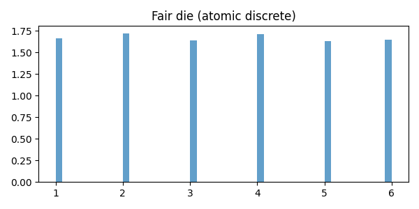
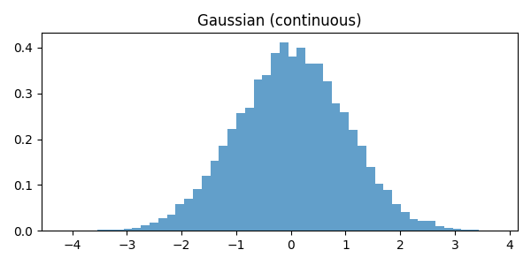
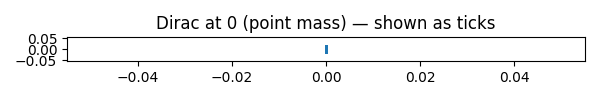
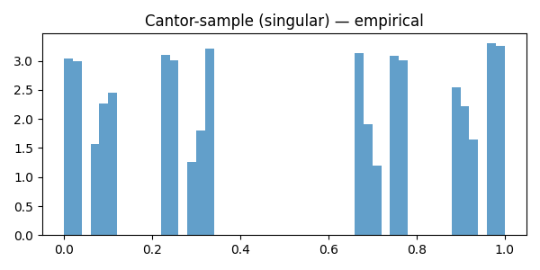

# Measure Theory — Categories & Examples

## What is a measure?

- A measure `μ` assigns a nonnegative extended real number to measurable sets.
- Key properties:
  - `μ(∅)=0`
  - Countable additivity: if `(A_i)` are disjoint then `μ(⋃A_i)=Σμ(A_i)`

---

## Finite measures

- Definition: `μ(X) < ∞` for the whole space `X`.
- Example: any probability measure (e.g., uniform on `[0,1]`) — total mass 1.
- Use: expectations and L^1 spaces with globally bounded mass.

---

## σ-finite measures

- Definition: `X` is a countable union of measurable sets each with finite measure.
- Example: Lebesgue measure on `ℝ` is σ-finite because `ℝ=⋃_{n∈ℤ}[n,n+1]` and each interval has finite measure.
- Counting measure on `ℕ` is σ-finite (singletons have measure 1).
- Many theorems (Radon–Nikodym, Fubini) require σ-finiteness.

---

## Non-σ-finite example

- Example: the measure `μ` on `X` defined by `μ(∅)=0` and `μ(A)=∞` for all nonempty measurable `A` is not σ-finite.

---

## Atomic vs nonatomic measures

- Atomic (has atoms): there exists a measurable `A` with `μ(A)>0` and every measurable subset `B⊂A` either has `μ(B)=0` or `μ(B)=μ(A)`.
- Example (atomic): Dirac measure `δ_{x0}` concentrated at a point.
- Nonatomic: no atoms; mass can be split arbitrarily. Example: Lebesgue measure on `ℝ`.

---

## Absolute continuity and singularity

- `ν` ≪ `μ` (absolutely continuous) if μ(A)=0 ⇒ ν(A)=0.
  - Example: a probability with density `f` w.r.t. Lebesgue (e.g., Gaussian) is absolutely continuous.
- `ν` ⟂ `μ` (singular) if there exists `A` with μ(A)=0 and ν(X\A)=0.
  - Example: Cantor distribution is singular w.r.t. Lebesgue.

---

## Complete measures

- A measure `μ` is complete if every subset of a μ-null set is measurable and has measure 0.
- Example: Lebesgue measure is complete by construction; counting measure is complete.

---

## Product measures

- Given `(X,μ)` and `(Y,ν)`, under standard conditions there exists a product measure `μ×ν` on `X×Y` (Fubini/Tonelli apply when σ-finite).
- Example: Lebesgue measure on `ℝ^m × ℝ^n` is the product of Lebesgue measures on `ℝ^m` and `ℝ^n`.

---

## Specific examples summary

- Finite & nonatomic: uniform `[0,1]` (probability, Lebesgue-restricted).
- σ-finite but infinite total mass: Lebesgue on `ℝ`.
- Atomic & finite: finite discrete probability (e.g., fair die).
- Pure point/atomic infinite: counting measure on `ℕ` (infinite total mass but σ-finite).
- Singular: Cantor measure (singular w.r.t. Lebesgue).

---

## Why these categories matter

- They determine which theorems apply (Radon–Nikodym, Fubini, Lebesgue decomposition).
- They capture different intuitions of "size": point mass vs spread-out mass vs fractal mass.

---

## Next steps

- Want illustrations, proofs, or code to sample/visualize these measures? I can add examples.
 
---

## Proof sketches

- Dirac measure `δ_{x0}` is a measure: `δ_{x0}(∅)=0`; for disjoint `(A_i)`, `δ_{x0}(⋃A_i)=1` iff `x0` lies in exactly one `A_i`, so countable additivity holds.
- Lebesgue measure is nonatomic: given interval `I` and ε>0, can bisect iteratively to find subinterval of measure < ε.

---

## Code: sampling & visualization (overview)

We'll provide a Python script that:

- Samples from discrete measures (fair die, counting measure via weighted samples).
- Samples continuous measures (uniform, Gaussian) via NumPy.
- Approximates Cantor (singular) distribution via random construction.
- Plots histograms and point plots using Matplotlib.

Example snippet (for slides):

```python
import numpy as np
import matplotlib.pyplot as plt

# Uniform [0,1]
u = np.random.rand(10000)
plt.hist(u, bins=50)
plt.title('Uniform [0,1] samples')
plt.show()
```

---

## Cantor distribution sampling (idea)

- To sample the Cantor distribution, repeatedly choose 0 or 2 with probabilities 1/2 and accumulate scaled sums: X = Σ (choice_k) / 3^k.
- This yields samples supported on the Cantor set and produces a distribution singular w.r.t. Lebesgue.

---

## Visualization examples



---

## Visualization examples

![Uniform [0,1] (continuous)](images/uniform_0_1.png)



---

## Visualization examples





---

## Files added

- `visualize_measures.py`: runnable script to sample and plot examples.
- `requirements.txt`: lists `numpy` and `matplotlib`.
- `README.md`: how to run the examples.

---

## Next

- I created the code and helper files; say if you want me to run the script here, or convert it into a Jupyter notebook for interactive slides.
